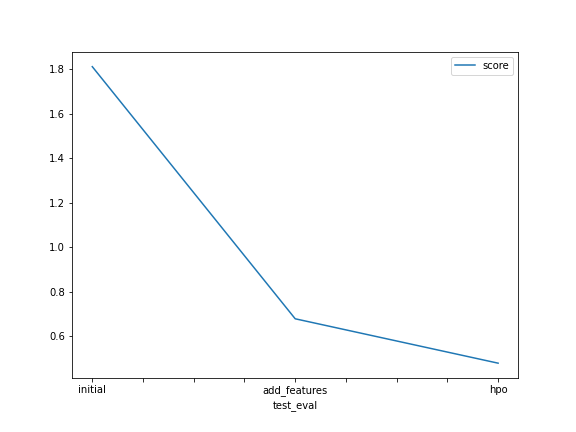

# Report: Predict Bike Sharing Demand with AutoGluon Solution
#### NAME HERE

## Initial Training
### What did you realize when you tried to submit your predictions? What changes were needed to the output of the predictor to submit your results?
Some values were negative and I had to set them to zero.

### What was the top ranked model that performed?
WeightedEnsemble_L2

## Exploratory data analysis and feature creation
### What did the exploratory analysis find and how did you add additional features?
Test dataset did not have `casual` and `registered` columns, so I dropped them from train datasets as well. When I added month, day and hour as feature, it improved model performamce. Hour had the strongest correlation with the target `count`. Also, `temp` and `atemp` were highly correlated to eachother.

### How much better did your model preform after adding additional features and why do you think that is?
The model improved around 20% upon adding new features. I think this was because hour had positive correlation with the target value. So, it was valuable to have it as a feature than just the datetime field.

## Hyper parameter tuning
### How much better did your model preform after trying different hyper parameters?
When I used an experimental hyperparameter `multimodal` the performance improved around 30%

### If you were given more time with this dataset, where do you think you would spend more time?
I would like to spend more time with the EDA part. May be come up with some new features.

### Create a table with the models you ran, the hyperparameters modified, and the kaggle score.
|model|hpo1|hpo2|hpo3|score|
|--|--|--|--|--|
|initial|eval_metric: root_mean_squared_error	| time_limit: 600	| presets: best_quality	| 1.81159|
|add_features|eval_metric: root_mean_squared_error	| time_limit: 600	| presets: best_quality	| 0.67929|
|hpo|eval_metric: r2	| time_limit: 600, presets: best_quality	| hyperparametes: multimodal	| 0.47991|

### Create a line plot showing the top model score for the three (or more) training runs during the project.

### Create a line plot showing the top kaggle score for the three (or more) prediction submissions during the project.

## Summary

Hour was most important feature, which resulted in improving model performance. Changing Hyperparameter also increased model performance. 
Given more time, I would like to deeply understand the effect of difference hyperparamenters on the predictions. I have tried a second one, 
but it seemed to have reduced the model score. 
Also, I would like to explore the data further to create new features.